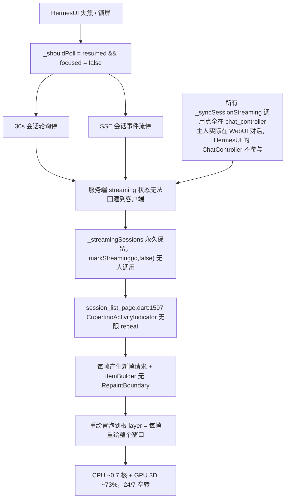

# Hermes UI TODO — Active（进行中队列 · 完整规格）

> **规则**：
> 1. 新增任务直接在【本文件】写完整规格（位置/范围/复现/现状vs预期/验收），不写日期文件。
> 2. 条目完成收口 → 将完整条目【誊写】到完成当天日期文件 `.todo/YYYYMMDD.md`（不存在则新建)，标题标 `[已收口]` 作归档备份；随后从本文件移除该条。
> 3. 本文件只保留未收口任务，收口即清出。

---

（#103 @77211b2、#104 @caaafa1、#105 @5ea4b14、#106 @d99d120、#107 @92e7449、#108 @d8b9973、#109 @a922086 已收口誊写至 `.todo/20260914.md`，其中 #103/#105/#106/#107/#108/#109 待主人真机/实机复验；#110 099131e、#111 b9b7ae0 已收口誊写至 `.todo/20260914.md`（#110/#111 待主人真机复验）；#76 二期 @8b4fab1 已收口誊写至 `.todo/20260914.md`（打包瘦身，安装包产物已本机取证）；#87/#88 已收口誊写至 `.todo/20260907.md` @f01c91d；#91 @0076554；#93 @0a69ee2；#95 @da21ea2；#96/#97 APK 安装权限与分享按钮已收口誊写至 20260907.md，随补丁批次 commit；#98 @5c19de7 与 #99 交付 @b9df051（含诊断原档）已收口誊写至 `.todo/20260908.md`；#116 @v0.1.47、#117 @本轮提交 已收口誊写至 `.todo/20260914.md`；#114 P0（展开态真应用图标/倒计时方向/small icon 剪影）@49062b4 已收口誊写至 `.todo/20260914.md`（待主人真机复验）；#121 @a299b60（live 回合中途恢复正文重复塞段）已收口誊写至 `.todo/20260915.md`（待主人真机复验）；#112 @d3b1c58（死锚 re-anchor + 指纹去重）、#113 @5ecb39a（WorkManager 状态行三态）、#114 P1 @846d010（ProgressStyle 动态 tracker icon + 落点）已收口誊写至 `.todo/20260915.md`（待主人真机复验）；#122 @8d640f1（更新检查读真实版本 + 硬编码漂移护栏，随 v0.1.50 发布）已收口誊写至 `.todo/20260915.md`（待主人真机复验）；#123 @42d6d71（下载进度上岛 determinate 真进度 + 岛上工具名转译）、#124 @fb2484f（澄清弹窗消失重现 + 通知重复 + 等待态下岛）已收口誊写至 `.todo/20260915.md`（待主人真机复验））

## #125 长会话上滚分页：一次操作触发多次加载 + 加载后破坏滚动位置

**分类**：问题（bug）　**状态**：代码已交付（待主人真机复验）　**发现**：2026-09-15（主人报告）

### 位置（源码行号）
- 触发判据 + 滞回武装：`lib/features/chat/widgets/chat_message_list.dart` 的 `_onScroll`
- 加载入口 + 零推进封顶：同文件 `_loadOlderMessages`
- 位置恢复链 + 粗定位引子：同文件 `_restoreOlderScrollPosition`
- 收敛预算常量：同文件 `_maxOlderRestoreAttempts` / `_olderLoadRearmThreshold` / `_olderLoadStalledLimit`
- 分页状态写入（到底判定）：`lib/features/chat/chat_controller.dart` 的 `loadMessages` 分页分支

### 复现（真机长会话）
1. 打开长会话（历史 > 2 页，建议 ≥150 条，含代码块/工具卡）。
2. 持续上滚触发第一次分页（视口 `pixels <= 80`）。
3. 继续上滚重复触发第 2、3、4 次分页。

### 根因（实测取证，非推断）

**根因一（主因，同时解释两个现象）：前插一页把锚点推出 lazy 构建范围 → 收敛链空转、从不 jumpTo**
分页触发时捕获「视口顶缘条目 + 其视口 dy」作几何锚点（PATCH#93）。但前插一页可达数千像素，锚点条目被推到 lazy `ListView` 的构建范围（视口 ± cacheExtent）之外，而构建范围只随 `pixels` 移动 —— 纯「等帧」永远不会把它建出来。`_topEdgeAnchorDy` 恒为 null，收敛链既不归位、也不报错，一路空转到预算耗尽，`pixels` 停在原位（顶部带内）。
实测（widget test，50 条/页 ≈ 5300px）：`pixels` 停在 **79.5 / -2.6**，`attempts` 撞满预算 6，链一次 `jumpTo` 都没执行。由此同时产生主人的两个现象：
- 「加载后 y 轴被推走」＝ 视口停在历史头部，而内容已被前插；
- 「容易触发多次加载」＝ 视口仍在 `pixels <= 80` 带内，用户任何轻微上滚立刻再命中触发条件 → 连环加载。

**根因二：收敛帧预算计数器跨分页单调累加**
`_olderRestoreAttempts` 只在 session 切换（`didUpdateWidget`）归零，每次分页开始不重置；成功收敛与预算耗尽两条路径也都不重置。故它单调累加，撞满 `_maxOlderRestoreAttempts` 后每次分页首帧即判定「预算已尽」而放弃归位。
反向验证：仅禁掉这一行重置 → 测试立刻报「第 6 次分页实际已用 6 帧」。

**根因三：触发判据无滞回**
`pixels <= 80` 是纯固定像素阈值，只判位置、不判方向位移与冷却；唯一防线是请求返回即释放的在途锁 → 视口只要留在带内，后续滚动事件就会再打一发。
**叠加**：零新增分页（服务端该游标已无更早消息）不判定到底，`hasOlderMessages` 可长期为 true，被滚动事件反复触发同一页请求。

### 修复（`chat_message_list.dart` + `chat_controller.dart`）
| # | 改动 |
|---|------|
| 1 | 每次分页开始重置 `_olderRestoreAttempts = 0` 并清锚点残留（根因二） |
| 2 | 锚点不可见时，首帧用 extent 增量做**粗定位引子**把锚点带回构建范围，随后仍由锚点法逐帧精修 —— 估算只当引子、终值精度由锚点保证（根因一，区别于 PATCH#93 把估算当终值） |
| 3 | 顶部触发滞回：`pixels <= 80` 触发一次后解除武装，视口离开顶部带（`pixels > 200`）才重新武装（根因三） |
| 4 | 收敛预算 3 → 6 帧（长内容条目异步撑高需更多帧） |
| 5 | 分页返回 `fresh` 为空 → `hasOlderMessages = false`（服务端已无更早消息，判定到底） |
| 6 | 连续零推进（游标与条数都不变 = 无历史或请求失败）达 2 次封顶停手；单次零推进保持武装以便重试 |

### 回归测试（新增 `test/features/chat/chat_pagination_repeated_load_test.dart`）
`FakeChatApi` 新增 `sessionResultBuilder`（按 `messageBefore` 逐页回吐）与 `sessionMessageBefore` 记录；`ChatMessageListState` 暴露 `olderRestoreAttempts` / `olderLoadArmed` 白盒断言点。
- **RED-125-1** 连续 6 次分页：`attempts` 每次从 0 重启（修复后恒为 1，不再累加）、收敛链收工、每轮成功加载一页
- **RED-125-2** 分页后视口必须被补偿离开顶部带（`pixels > 200`）且只打一发请求
- **RED-125-3** 零新增分页 → `hasOlderMessages` 收敛为 false
- **RED-125-4** 零新增后反复滚动 → 分页请求次数有界（≤ 2）

**每个用例都做了反向验证**（逐条禁用对应修复 → 用例变红），确认护栏非空转，非「永远绿」的假测试。

### 验收
- [x] `flutter analyze` 零告警（含 info）
- [x] 新增 4 用例全绿
- [x] 反向验证：三条修复各自可被测试捕获
- [x] 全量 `flutter test` 无回归（2988 通过；唯一失败为 version 兜底常量漂移，已顺手修，见 #126）
- [ ] 主人真机复验：长会话连续上滚 5 次，位置不跳、无重复请求

### 遗留观察
- 测试中「连续第 7 轮上滚」未再触发加载（`pixels`/`maxScrollExtent` 完全不变），疑为 widget test 连续手势连发所致，非产品逻辑；测试已收敛到 6 轮。真机复验时留意是否存在真实的「加载到某一页后不再触发」。

## #126 回到前台清通知静默失效（clearAll 未初始化插件）+ 版本兜底常量漂移

**分类**：问题（bug）　**状态**：代码已交付（待主人真机复验）　**发现**：2026-09-15（主人贴日志报告）

### 位置
- `lib/features/notifications/turn_notification_service.dart` 的 `clearAll()`
- 触发路径：`lib/features/notifications/notification_lifecycle_observer.dart` 的 `resumed` 分支（App 回到前台自动清通知）
- 参照实现：同文件 `clearDownloadProgress()` / `requestPermission()` 都先 `await _ensureInitialized();`

### 根因
`clearAll()` 是全类唯一漏调 `_ensureInitialized()` 的方法（该守卫幂等：`if (_initialized) return;`）。App 冷启动/回到前台时插件尚未初始化，`_plugin.cancelAll()` 抛
`Bad state: Flutter Local Notifications must be initialized before use`；异常被下方 `catch` 吞掉（只留一条 error 日志），清除通知**静默失效**，旧通知残留在通知栏。
主人贴出的日志正是这条路：`[ERROR] [notifications] 清除通知失败 [error: Bad state: ... must be initialized before use]`。

### 修复
`clearAll()` 开头补 `await _ensureInitialized();`（与同类方法对齐）。

### 验收
- [x] 新增回归用例「未初始化时先初始化插件再取消」（`turn_notification_service_test.dart` 的 `clearAll` group）
- [x] 反向验证：禁掉该行 → 用例变红（护栏非空转）
- [x] `turn_notification_service_test.dart` 全绿（31 例）
- [ ] 主人真机复验：回到前台后通知栏不再残留旧通知，诊断日志不再出现「清除通知失败」

### 同批顺手修（本轮全量测试暴露的 pre-existing 失败）
`lib/core/update/version_info.dart` 的兜底常量 `appVersion` 停在 `'0.1.50'`，而 `pubspec.yaml` 已是 `0.1.51+57` → `version_info_test` 的「兜底常量与 pubspec 一致」护栏（#122 引入）失败。已改为 `'0.1.51'`。这是 v0.1.51 发布时的同步疏漏，与 #125/#126 无因果关系。

## #127 澄清作答后聊天不再更新（等待态结束未接回推送通道）+ 静默兜底巡检 guard

**分类**：问题（bug）+ 系统性加固　**状态**：代码已交付（待主人真机复验）　**发现**：2026-09-15（主人贴日志并报告现象）

### 现象
选择完澄清回复后，聊天界面不再更新（agent 后续输出到不了界面）。主人最初怀疑与 `清除通知失败` 日志同源。

### 取证（先排除误判）
`清除通知失败` 那条异常**不可能**导致聊天停止更新：调用点是 `unawaited(...clearAll())`（notification_lifecycle_observer），且 `clearAll` 内部把异常整个 catch 掉（只留日志）——异常传不出去也不阻塞生命周期回调。故另立本条目，通知问题见 #126。

### 根因（源码级证据链）
1. `chat_controller.dart` 的 `_handleAppLifecycleChange` resumed 分支（约 1714-1718）：`isStreamingActive` 要求 `!state.pendingAction.hasPendingPrompt` —— **澄清等待态下主动探活/重连被门控挡掉**（该排除来自早期 `6ad6f09`，长期潜伏）。
2. 等待期间 App 通常在后台（用户从系统通知点回），两条 SSE（回合流 + `/api/session/stream` 会话内容通道）会**静默断线**（无 `onTransportError`/`onClosed`，只能靠时间差识别）。
3. `respondToClarification` / `respondToApproval` 作答成功后只 `_clearXxxCard()`，**清卡路径不重建任何通道**；而 `_checkStatusAndReconnect` 入口是 `activeStreamId == null` 即 return，会话内容通道也只在 sessionId 变化时重建。
→ 通道断了没人接回来 ⇒ 服务端继续输出而界面静止。

### 修复
1. **等待态结束接回通道**：新增 `_resumeChannelsAfterPromptResolved()`（作答成功 + 澄清超时调用）——重建会话内容通道（内部 stop-then-start，幂等；服务端开新回合由它的 `onServerTurnStarted` 接管）。
   **注（设计收敛）**：初版还在此立刻 `_checkStatusAndReconnect()`，全量回归打红 `chat_controller_test` 的「作答后回 streaming」（`Expected streaming, Actual idle`）——作答刚提交时服务端尚未开新回合，探活拿到 `active=false`，既有分支把 phase 误落 idle。故撤掉立刻探活，断线最终交给兜底巡检（15s 内）。
2. **静默兜底巡检 guard（主人要求）**：`_runStallGuardIfNeeded()` 挂进既有 1s watchdog。**不依赖任何单一事件**——满足「存在未决期待」且长时间（15s）无任何服务端进展、无活跃流时，主动 `syncMissingMessages()` 拉会话把内容兜回来（该调用顺带能接管服务端新开的流）。
   四重门控保证低频不打扰：仅前台 + 仅无活跃流（有流交给 transport-stale 链，避免双路争抢）+ **仅 `_awaitingServerContent`（发送/作答后尚未收到任何进展）** + 动作后 90s 激活窗口内（空闲会话永不触发）+ 20s 冷却。静止基线取「最近进展与动作时刻的较晚者」，避免刚动作即误判。
   **注（设计收敛）**：初版只有时间判据，全量回归打红 `chat_context_window_poll_test` 的「无残留请求」（`Expected 2, Actual 3`）——回合正常收尾后仍会多拉一次；故引入 `_awaitingServerContent`（`_markUserAction` 置 true / `_markProgress` 置 false）。

### 验收
- [x] `flutter analyze` 零告警
- [x] 用例 13「作答后主动探活」——反向验证：禁掉该调用即变红
- [x] 用例 14「动作后长时间无进展 → 兜底拉取」——反向验证：禁掉巡检即变红
- [x] 用例 15「门控：阈值内不抢跑拉取」
- [x] `clarify_lifecycle_test.dart` 15 例全绿
- [ ] 主人真机复验：从系统通知点回 → 选澄清 → agent 续跑应正常逐字更新；若仍出现静止，诊断日志应出现 `chat_stall_guard` 兜底记录

## #128 窄屏点击大标题 = 点击右侧快捷导航 ▾

**分类**：方向（交互一致性）　**状态**：代码已交付 @9a97db6（待主人真机复验）　**发现**：2026-09-15（主人截图报告）

### 现象（现状 vs 预期）
- **现状**：窄屏（width < 900）各页大标题右侧的 ▾（`NarrowNavigationDropdownButton`，44×44 热区）是唯一入口；点击标题文字「会话」等**无任何反应**，必须精准点到那个小三角。
- **预期**：点击大标题文字 = 点击它右侧的 ▾（打开同一个快捷导航下拉菜单，弹层锚点与位置不变）。滚动后收起态的中标题同样可点。

### 位置（源码行号）
| 角色 | 文件 | 关键行 |
|---|---|---|
| 会话列表页头部（基准） | `lib/features/session_list/session_list_header.dart` | 大标题 253-269、收起态中标题 235-251、▾ 271-276 |
| 其他功能页共用头部 | `lib/app/widgets/large_title_sliver_header.dart` | 大标题 300-329、收起态中标题 244-296、▾ 334-345、`_wrapTitle` 126-133 |
| 窄屏 ▾ 落地处 | `lib/app/widgets/adaptive_sliver_navigation_bar.dart` | 116-118（`const NarrowNavigationDropdownButton()`） |
| ▾ 组件（打开逻辑） | `lib/app/widgets/narrow_navigation_dropdown.dart` | `_openMenu` 45-106、build 108-127 |
| 会话页自建 ▾ | `lib/features/session_list/session_list_page.dart` | 302 |
| 双击回顶（唯一使用者） | `lib/features/settings/settings_page.dart` | 94（`onTitleDoubleTap: _scrollToTop`） |

覆盖页面：`AdaptiveSliverNavigationBar` 全部窄屏使用者 —— tasks / kanban / workspaces / workspace / skills / insights / memory / git / settings / session_list（共 10 处入口）。

### 实现要点
1. 新增「打开请求」通道：`NarrowNavigationDropdownButton` 增加可选 `Listenable openSignal`（页面/导航栏持有的 `ValueNotifier<int>`），监听后调用既有 `_openMenu`；不改弹层锚点（仍在 ▾）。
2. `AdaptiveSliverNavigationBar` 改 StatefulWidget 持有该 notifier（9 个页面零改动），窄屏把 `onTitleTap` 传给 delegate；`showNarrowNavigationDropdown == false` 的页面不接线（点击仍无效）。
3. 两个 delegate 各增 `onTitleTap`：`_wrapTitle` 同时挂 `onTap`（打开菜单）与既有 `onDoubleTap`（回顶）。**主人拍板：保留双击回顶，单击因双击判定窗口延迟约 0.3s，全页面一致。**
4. 热区 = 标题文字盒自然宽（展开态 34pt 行 / 收起态 17pt 行），**不含**标题左侧 20pt 留白与右上角 actions 区（防误触、防抢按钮点击）；仅注册 tap 手势，不影响滚动手势竞技场。
5. 宽屏（≥ 900）与横屏（无大标题行）行为不变。

### 交付实现（2026-09-15）
| 文件 | 改动 |
|---|---|
| `lib/app/widgets/narrow_navigation_dropdown.dart` | 新增 `Listenable? openSignal`：被通知即等同点击 ▾，复用同一 `_openMenu`/锚点；`initState`/`didUpdateWidget`/`dispose` 全生命周期管监听 |
| `lib/app/widgets/adaptive_sliver_navigation_bar.dart` | 改 StatefulWidget 持有 `ValueNotifier<int>` 通道（9 个页面零改动）；窄屏把 `onTitleTap` 接线给 delegate，`titleTrailing` 传 `openSignal` |
| `lib/app/widgets/large_title_sliver_header.dart` | 新增 `onTitleTap`（含 `shouldRebuild` 比较）；`_wrapTitle` 同时挂 `onTap` + `onDoubleTap` |
| `lib/features/session_list/session_list_header.dart` | 新增 `onTitleTap`；大标题 / 收起态中标题抽出 `_largeTitleLabel` / `_collapsedTitleLabel`，未接线时不加 GestureDetector（命中零变化） |
| `lib/features/session_list/session_list_page.dart` | 页面持有通道 + `_requestNarrowNavMenu`（tear-off 稳定，避免 delegate 每帧 rebuild）；条件与 ▾ 同源 `!isWide && !isSearchMode` |
| `test/app/narrow_title_tap_test.dart` | 新增 9 例（含 1 源码接线护栏） |

### 验收
- [x] 窄屏会话列表页：点「会话」→ 弹层与点 ▾ 完全一致（同 items、同位置、同 key）
- [x] 其余功能页同断言（`AdaptiveSliverNavigationBar` 头部路径，测试覆盖同组件）
- [x] 滚动后收起态中标题可点（同菜单）
- [x] 设置页：单击标题 → 菜单（≤ 双击窗口内到位）；双击标题 → 回顶且**不**弹菜单
- [x] `showsAny == false`（无 ▾）时点标题无弹层；`showNarrowNavigationDropdown: false` 同理
- [x] 宽屏（≥ 900）零变化；`session_title_alignment_test` 几何不回归
- [x] 反向验证：禁掉 `onTap: onTitleTap` 3 处 → 5 例变红（负向用例仍绿），护栏非空转
- [x] `flutter analyze` 零告警 + 全量 `flutter test` 3002 通过（金照零变更）
- [ ] 主人真机复验：窄屏点「会话」/「技能」/「设置」等标题都能弹出右侧 ▾ 的菜单

## #134 选中正文片段后右键弹出两层菜单（原生文本工具条叠自定义消息菜单）

> 编号说明：本条最初按 #129 记录，但同日在并行会话中 #129 已被占用（灵动岛下岛时机重构 @583733f），故改号为 **#134**。

**分类**：问题（bug）　**状态**：代码已交付 @41be4e9（已 ff 并 main + 推送 `origin/main`；待主人真机复验）　**发现**：2026-09-15（主人截图报告）

### 现象（现状 vs 预期）
- **现状**：选中聊天正文任意片段后右键 → **同时**弹出两层菜单：上层深灰 = Flutter 原生文本选择工具条（`复制` / `全选`），下层近黑 = 自定义消息菜单（`复制` / `复制 Markdown` / `从此处创建分支` / `从此处截断`）。
- **预期**：一次右键 / 一次长按**只出一层**自定义消息菜单；有选区时菜单顶部多一项「复制选中文本」（复制整条消息的能力保留）。

### 位置（源码行号）
| 角色 | 文件 | 关键行 |
|---|---|---|
| 抑制器（**有选区时放行 = 根因**） | `lib/features/chat/widgets/chat_text_selection.dart` | 22-33（`selection.isCollapsed` 分支） |
| 自定义菜单触发（无条件弹） | `lib/features/chat/widgets/chat_message_list.dart` | 2497-2535（`onSecondaryTapDown` / `onLongPress`）、1724-1804（`_showMessageActions`） |
| 自定义菜单本体 | `lib/features/chat/widgets/message_action_menu.dart` | 宽屏 popover 148-279、窄屏 ActionSheet 55-145 |
| 抑制器接线（4 处） | `message_bubble.dart` 228 / 366、`injected_notice_card.dart` 121、`selected_context_card.dart` 113、`mermaid_block.dart` 137 | |
| vendored 透传 | `third_party/flutter_markdown/lib/src/builder.dart` | 1095-1119（`contextMenuBuilder` + `onSelectionChanged`）、1069 / 1102 / 1115 |
| 既有回归（断言需按新契约更新） | `test/features/chat/message_context_menu_native_toolbar_test.dart` | 186-196 |

### 根因（实测）
#81（`third_party/flutter_markdown/PATCH_NOTES.md` §4，2026-09-13）只压了「无选区」那一半：它认为有选区时原生工具条有价值，故 `chatMessageTextContextMenu` **放行**有选区的工具条；而消息级 `GestureDetector.onSecondaryTapDown` **无条件**弹自定义菜单 → 同一指针事件两条链路各弹一层。既有测试 186-196 明确断言「有选区 → 返回 Cupertino 工具条」，即双层是当初**刻意的取舍**而非疏漏，故本轮属方向变更（主人拍板）。

### 方案（主人 2026-09-15 拍板）
1. 抑制器**无条件**返回零尺寸占位：任何平台、任何选区状态，正文右键 / 长按都不得出原生工具条。
2. 选区感知走 vendored `MarkdownBody.onSelectionChanged`（`lib/` 此前零使用者）→ 消息粒度登记选中片段（`ChatMessageListState._selectionByRenderId`，拖动期间不上 `setState`）。
3. 菜单顶部新增「复制选中文本」（key `msg-action-copy-selection`，l10n `copySelection`），仅在有选区时出现；「复制」保持「整条消息」语义。
4. 顺带修 vendored 缺陷：`builder.dart` 回调实参 `text.text` → `text.toPlainText()`（含子 span 的段落 `TextSpan.text` 为 null，否则拿不到选中文字）+ PATCH_NOTES 同步。

### 交付实现（worktree `agy/aug24-ctxmenu`，基线 `4df87ad`）

| 文件 | 改动 |
|---|---|
| `lib/features/chat/widgets/chat_text_selection.dart` | 平台判据改为 `_usesNativeToolbarOnLongPress`：**桌面（win/linux/macOS）无条件抑制**原生工具条；**移动（android/iOS/fuchsia）保留**原语义（空选区抑制、有选区放行） |
| `lib/features/chat/widgets/chat_message_list.dart` | ① 右键触发由 `GestureDetector.onSecondaryTapDown` 改为 **`Listener.onPointerDown`**（按 `kSecondaryMouseButton` 过滤，不参与手势竞技场）；② 新增 `_selectionByRenderId` 选区登记表（不上 `setState`，会话切换/dispose 清空）；③ `_showMessageActions` 增 `selectionText` 参数 + `MessageAction.copySelection` 分支 |
| `lib/features/chat/widgets/message_bubble.dart` | 新增 `onTextSelectionChanged` 透传；两处 `MarkdownBody` 接 `onSelectionChanged` → `_dispatchTextSelectionChanged`（null 守卫 / collapsed 清登记 / normalize+trim 后上报片段） |
| `lib/features/chat/widgets/message_action_menu.dart` | 新增 `MessageAction.copySelection` 与顶部菜单项 `msg-action-copy-selection`（popover 与 ActionSheet 两分支；popover `preferredHeight` 相应 +40） |
| `lib/l10n/app_localizations.dart` | 新增 `copySelection`（`Copy Selection` / `复制选中文本`）。**未动 `.arb`**（那三个文件是同族并行会话的作业面） |
| `third_party/flutter_markdown/lib/src/builder.dart` + `PATCH_NOTES.md` | 回调实参 `text.text` → `text.toPlainText()`（含子 span 的段落 `TextSpan.text` 为 null，否则拿不到选中文字）+ 补记 PATCH_NOTES §4 |
| `test/features/chat/message_context_menu_native_toolbar_test.dart` | 按平台双契约重写：桌面（有/无选区皆抑制）+ 移动（有选区保留工具条） |
| `test/features/chat/message_selection_context_menu_test.dart` | 新增 6 例（RED-A/A2/B/C/D/E） |

**触发确定性的关键改动（Listener）**：一次右键谁弹层，取决于**点击落点**——点**正文文字**时内层 SelectableText 的选字手势在手势竞技场里抢赢外层 `onSecondaryTapDown`：快速右键（down/up 同帧）外层**收不到回调**、慢速右键（按住越过 `kPressTimeout`）才收到；点气泡**留白**时外层稳赢（既有 `message_action_menu_test` 全用 tapAt(留白) 且全绿为证）。双层菜单正是这条竞态的另一面（用户截图 = 慢速那支 + 内层工具条）。**判别实验（旧触发 + 新抑制，实测）**：快速右键 `菜单=0 工具条=0`（死点）/ 慢速右键 `菜单=1` → 故必须同步改触发。改用 `Listener.onPointerDown`（按 `kSecondaryMouseButton` 过滤，原始指针事件不参与竞技场）后：快/慢右键均 `菜单=1 工具条=0`。

**移动端策略（与主人的方向有一处偏差，依据实测）**：安卓长按正文时气泡外层 `onLongPress` 被 SelectableText 的选字手势抢赢（实测自定义菜单 0 个，仅留白区长按才走自定义菜单）⇒ 两层菜单在移动端**本就不会同现**；而原生工具条是移动端「选中即复制」的唯一入口（实测修复前基线：长按松手时工具条 8 个节点）。若一刀切抑制，主人的主力平台会直接失去复制能力，故**移动端保留工具条**。若主人要求移动端也一律只出自定义菜单，可另开一条（需同时把长按触发也改成确定性方案）。

### 验收（实测取证）
- [x] 有选区右键：原生工具条 **0 个**（修复前基线 **4 个节点**）+ 自定义菜单恰 1 层（RED-A 双击选词 / RED-A2 拖选）
- [x] 有选区：菜单出现「复制选中文本」，复制内容 == 选中片段而非整条（RED-C，剪贴板实捕）
- [x] 无选区：菜单项不出现在菜单里（RED-B），且快速右键也能稳定弹出菜单（Listener 护栏）
- [x] 移动端：两层不同现不变量（RED-D）+ 留白长按出 ActionSheet（RED-E）
- [x] 反向验证（两条都实测变红，非空转）：① 抑制器改回旧逻辑 → RED-A `Expected: <0> Actual: <4>`；② 停用 Listener 触发 → RED-B `msg-action-copy` 0 个
- [x] `analyze`：变基到新 main 后**「No issues found!」全清**（本 worktree 旧基线 `4df87ad` 自带的 2 条 `narrow_title_tap_test` info 由新 main 修掉）
- [x] 相关三文件 18 例全绿
- [x] 全量 `flutter test`：**3019 通过 / 8 skip / 0 失败**（变基到新 main 后重跑；过程曾出现 1 例 `chat_scroll_bottom_bound_test` 失败，单跑两次全绿 ⇒ 并发干扰型 flaky，非回归）
- [ ] 主人真机复验（Windows 右键：选中片段后右键应只出一层菜单且含「复制选中文本」；安卓长按正文仍可复制）

## #129 灵动岛（实况通知）下岛时机重构：「已完成/已中断」态上岛 + 掐断三处误撤

**分类**：问题（bug）+ 方向（#48 五态补齐）　**状态**：代码已交付 `@583733f`（待主人真机复验）　**发现**：2026-09-15（主人报告）

### 现象
1. 岛「莫名其妙下岛」——明明还有状态需要表示（等待回复/等待批准）。
2. 「已完成」态不显示。

### 根因（源码级：三处独立误撤 + 一处从未实现的态）

**误撤①（真凶，本次回归源头）#126 修好的 `clearAll()` 把岛一起清了**
- `lib/features/notifications/notification_lifecycle_observer.dart:60`：AppLifecycleState.resumed → `clearAll()`（本意只清**普通**通知）。
- `lib/features/notifications/turn_notification_service.dart` `clearAll()` → `_plugin.cancelAll()`。
- flutter_local_notifications 22.3.0 `FlutterLocalNotificationsPlugin.java:1869-1871`：`cancelAllNotifications()` → `NotificationManagerCompat.cancelAll()` —— Android 语义是**清掉本 App 发布的全部通知**，不认 ID、不认发布者。
- 岛由 `android/.../MainActivity.kt:398` 用**同一个** `NotificationManagerCompat.from(this).notify(id=1501, …)` 挂载 → 一并被清。
- **为什么是「现在」**：`clearAll()` 原先漏 `_ensureInitialized()`，未初始化即抛 `Bad state: …must be initialized`，异常被 catch 吞掉 = 什么都没清；#126（`72e4733`，2026-09-15 15:08）补上守卫后它才真正开始执行 `cancelAll` → 表现为该提交之后的回归。

**误撤② 澄清 hook 无条件撤岛（等待态上不了岛的元凶）**
- `lib/features/chat/chat_controller.dart` `_applyClarificationUpdate`：先 `_reportLiveActivity(waitingReply)`（:2421）**再** `_notifyClarificationNeeded`（:2427）。
- `lib/features/notifications/notification_providers.dart` 澄清 hook 内 `LiveUpdateService.instance.cancelAll()` 无条件执行，其同步前缀必然覆盖刚上报的等待态。
- **叠加放大**：`LiveUpdateService.cancelAll()` 只清**服务侧** `_activity/_lastShown`；chat 侧 `_liveActivity` 去重表无人重置 → 之后 20s 澄清轮询重建卡片走到 `_reportLiveActivity(waitingReply)` 被去重跳过 → **岛再也回不来**（#124 E「轮询重建卡片即自动回岛」因此空转）。

**误撤③ 回合完成 hook 无条件撤岛**
- 同文件 `turnNotificationHookProvider` 顶部 `cancelAll()`（位于开关判定**之前**）。#105 时代岛只是「会话列表总览」时的兜底；**#120 改事件驱动后**该调用成为对打死。

**缺失态「已完成 / 已中断」**
- `ChatLiveActivity.finished` 在 `chatLiveActivityHookProvider` 被映射成 `null` = 撤岛；#120 的交付定义就是「收尾→撤销」。
- l10n 只有 `生成中/请回复/请批准/下载中` 四个 chip，#48 定稿的「已完成/已中断」从未落地（HERMES.md #49 状态为「待主人开批」）。

### 修复（主人拍板：A + B 一起做，已完成停留 15s）
| # | 位置 | 改动 |
|---|------|------|
| 1 | `turn_notification_service.dart` `clearAll()` | Android 改**按分区 ID 精确清**（1001/1101/1201/1301/1401），**不碰 1501**；非 Android 保持 `cancelAll()`（该平台无实况岛） |
| 2 | `notification_providers.dart` 澄清 hook | **删除**无条件 `cancelAll()` |
| 3 | `notification_providers.dart` 回合完成 hook | 同上删除（撤岛责任全归 chat 事件驱动） |
| 4 | `chat_controller.dart` `_reportLiveActivity` | 等待态（waitingReply/waitingApproval）**豁免 chat 侧去重**：外部撤岛后轮询重建卡片即可自动回岛（服务层 `_lastShown` 幂等仍兜住平台通道调用 → 无 notify 风暴） |
| 5 | `chat_controller.dart` `_reportTurnSettled` | 分「已完成 / 已中断」：done·stream_end → completed；cancel·error → interrupted；等待态仍稳压岛 |
| 6 | `chat_controller.dart` 新增 `liveActivityDwell = 15s` | 完成/中断态上岛后停留 15s，到期报 `finished` 撤岛；期间任何进行中/等待态上报即**取消计时**（新活动接管）；`_dispose` 清理计时器 |
| 7 | `chat_providers.dart` | `ChatLiveActivity` 增 `completed` / `interrupted` |
| 8 | `live_update_service.dart` | `LiveUpdateActivity` 增 `completed` / `interrupted`：文案「回合已完成/回合已中断」、chip「已完成 Done / 已中断 Stop」（#48 定稿）、trackerIcon `completed`/`interrupted`；**completed 走确定进度条 100%**（满载=完成、停止动画），interrupted 保持 indeterminate |
| 9 | `MainActivity.kt` + 新增矢量 | trackerIcon 增 `completed → ic_live_done`（粗勾）/ `interrupted → ic_live_stop`（圆角实心方块）；均为大块面实心，24dp 可辨（#50 教训：细线族在 24px 必断） |
| 10 | l10n | `app_localizations.dart` + `app_zh.arb` + `app_en.arb` 补齐 4 键 |

### 撤岛责任划分（修复后唯一真相）
- **收尾撤岛** = chat 事件驱动（完成/中断态停留 15s → `finished`）
- **后台兜底** = 后台 isolate `_cancelLiveUpdateNotification()`（keepalive）
- **会话列表归零** = `sync(activeCount: 0)` → `_compose()==null`
- **开关关闭** = 设置页 `cancelAll()`
- 不再存在「回前台 / 回合完成 / 澄清弹出」这类与岛语义无关的撤岛

### 验收
- [x] `flutter analyze` **零告警（含 info）**——顺手清零 #128 遗留的 `narrow_title_tap_test.dart` 2 条 `prefer_const_constructors`（同 #126 批次的「同批顺手修」惯例）
- [x] 新增/升级用例：服务层完成/中断态文案+chip+图标+确定进度条；clearAll 按 ID 清且 `verifyNever(cancelAll)`/`verifyNever(cancel 1501)`；chat 侧 15s 停留、中断语义、停留期新活动接管、等待态豁免去重；hook 不再撤岛（含反向护栏证明断言非空转）
- [x] 全量 `flutter test`：**3012 通过 / 8 skipped / 0 失败**，金照零变更（无需 `--update-goldens`）
- [ ] 主人真机复验：① 澄清弹出时岛上显示「请回复」且不再消失；② 回合完成岛上显示「已完成」约 15s 后消失；③ 取消/报错显示「已中断」；④ 回到前台不再把岛清掉

> 契约升级说明：`stream_end` / 清卡回落不再直接报 `finished` 撤岛，改为 `completed`（15s 后 `finished`）。3 个既有用例随之升级：`chat_live_activity_test` 收尾用例、`clarify_lifecycle_test` 第 10/12 例。

---

## #135 SSE 长连接通道去重：抽公共基类（行为零变化重构）

**分类**：方向（工程基建 / 去重复）　**状态**：代码已交付（待主人真机复验）　**发现**：2026-09-15（重复率量化后定位到的全仓唯一结构性重复）

### 位置（重构前）
| 角色 | 文件 | 原行数 |
|---|---|---|
| SSE 客户端 A（会话内容流） | `lib/features/chat/chat_session_channel.dart` | 383 |
| SSE 客户端 B（会话列表流） | `lib/features/session_list/session_events_client.dart` | 343 |

### 根因（jscpd 实测）
两者之间有 **208 行跨文件重复**（5 个块：50/47/47/33/31 行）——连接生命周期骨架（字段、`start`/`stop`/`dispose`、指数退避、认证头/Cookie 注入、`SseWireParser` 流读取、异常分类）**几乎逐行相同**，各自只有 `processWire` 的事件分支不同。这是全仓唯一的**结构性**重复（其余为卡片内部同构渲染）。

### 修复（行为零变化）
| # | 文件 | 改动 |
|---|---|---|
| 1 | `lib/core/api/sse_channel_base.dart`（新增） | 抽象基类 `SseChannelBase`：收编连接骨架 + 4 个子类钩子（`buildUrl()` / `processWire()` / `canStart()` / `onConnected({wasReconnecting})`） |
| 2 | `lib/core/api/stream_toggle_controller.dart`（新增） | 抽象基类 `StreamToggleController extends Notifier<bool>`：收编两个开关 Controller 逐行相同的 `build`/`_load`/`load`/`setEnabled` |
| 3 | `chat_session_channel.dart` | 383 → **189 行**；`canStart()` 承接空 sessionId 守卫，`buildUrl()` 走 `Endpoint.sessionStream` |
| 4 | `session_events_client.dart` | 343 → **148 行**；`onConnected(wasReconnecting)` 承接「重连后补一次回调」语义 |
| 5 | 两个开关 Controller | 保留各自 `static const key` 与 `static loadPref()` 薄壳（既有测试直接引用静态方法，**不得丢失**） |
| 6 | `test/core/api/sse_channel_base_test.dart`（新增） | 10 例基类契约（退避序列到边界、幂等、门控、重连与 CancelToken 接线、回调标记） |

**#73 防线保持**：`_cancelToken` 接线（每次连接新建 CancelToken → 绑 RequestOptions → 取消判定）逐字搬进基类，未简化。

### 验收（实测取证）
- [x] `flutter analyze` 零告警（基类 + 两子类）
- [x] 定向测试 34 例全绿：`chat_session_channel_test`(650 行) / `session_events_client_test`(557 行) **一行未改**且全绿 —— 行为零变化的最强证据；新增 `sse_channel_base_test` 10 例
- [x] 全量 `flutter test` **3029 通过 / 8 skipped / 0 失败**（worktree 旧基线约 3020 例 + 新增 9）
- [x] **RED 校验**：临时禁用基类 `onConnected` 接线 → 用例 8 变红（`Expected: [false] Actual: []`）→ 还原后复绿（护栏非空转）
- [x] **重复率 KPI**：`lib/` 3.68% → **3.37%**（重复行 2238 → 2044，**净减 194 行**；克隆块 160 → 155）；`chat_session_channel.dart` 与 `session_events_client.dart` 之间的 5 个块**全部消失**
- [ ] 主人真机复验：聊天 SSE（会话内容流）+ 会话列表实时刷新（sessions 事件流）行为不变

### 过程备注
隔离 worktree `agy/sep15-sse-base`（基线 `f0fd3bd`）。agy 于 `flutter analyze` 阶段被**地区墙**（`FAILED_PRECONDITION: User location is not supported`）打断、未写 RESULT.md，主体代码已完成，Leader 接手复验收口。

---

## #137 异步委派通知（`[ASYNC DELEGATION …]`）不折叠：三形态收进注入通知卡

**分类**：问题（bug / 一致性缺口）　**状态**：代码已交付（待主人真机复验）　**发现**：2026-09-16（主人报告，附截图）

### 位置（源码行号）
- 检测白名单：`lib/core/utils/injected_message.dart` `_isInjectedNoticeText`（原仅认 `[IMPORTANT:` / `[SYSTEM:` 前缀，本族整族漏判）
- 分类：同文件 `classify`（`background subagent` 兜底会吞掉 `COMPLETE` 形态）
- 摘要：同文件 `extractSummary`（旧行为对 `COMPLETE` 形态退化为原始英文首行串）
- 渲染：`lib/features/chat/widgets/injected_notice_card.dart`（`_iconForKind` 无对应 kind）+ `lib/features/chat/widgets/message_bubble.dart:91`（未命中 → 走普通蓝泡）
- 消息生成端（权威）：`hermes-agent/tools/process_registry_notifications.py` `_format_task_failure_notice` L152 / `_format_batch_delegation` L171 / `_format_async_delegation` L238

### 复现
聊天流里出现下列任一消息（`role=user`、producer 注入）：
1. `[ASYNC DELEGATION TASK FAILED — deleg_841a0035, task 1/3]`（兄弟仍在跑时的提前告警）
2. `[ASYNC DELEGATION BATCH COMPLETE — deleg_x]`（扇出批量收口）
3. `[ASYNC DELEGATION COMPLETE — deleg_y]`（单条子代理收口）

### 现状 vs 预期（实测取证：探针测试跑分类器）
| 形态 | 现状（修复前实测） | 预期 |
|---|---|---|
| TASK FAILED | `isInjected=false` / `kind=none` / 摘要空 → **整段英文报文裸铺蓝泡** | 折叠卡：`委派任务 deleg_841a0035 · 任务 1/3 失败` |
| BATCH COMPLETE | `isInjected=false` / `kind=none` / 摘要空 → **同上裸铺** | 折叠卡：`委派任务 deleg_x · 批次完成` |
| COMPLETE | `isInjected=true` 但摘要 = `"[ASYNC DELEGATION COMPLETE — deleg_y"`（原始英文串） | 折叠卡：`委派任务 deleg_y · 已完成` |

### 修复
| # | 文件 | 改动 |
|---|---|---|
| 1 | `lib/core/utils/injected_message.dart` | 新增 3 kind（`subagentTaskFailed` / `subagentBatchComplete` / `subagentComplete`）+ 预编译正则（前缀/失败模板/收口模板/去左括号）+ 检测白名单（整串 `[ASYNC DELEGATION` 前缀，producer-owned）+ `classify` 前置分支（必须在 `background subagent` 兜底前）+ `_asyncDelegationSummary`（`委派任务 <id> · <状态>`，中英）+ `_elideMiddle` 抽取（与后台进程 sid 共用同一条省略规则） |
| 2 | `lib/features/chat/widgets/injected_notice_card.dart` | 图标分派补 3 kind；**仅失败态**走红（复用工具卡同款 `statusRedText` + `tintError`，深色 `systemRed` 8% alpha），其余维持中性淡色 |
| 3 | `docs/specs/agent-injected-message-cards-spec.md` | 新增 §10（触发点行号 / 三形态样例 / 摘要规则 / 容错 / 配色理由 / 验收增量） |
| 4 | `test/core/utils/injected_message_test.dart` + `test/features/chat/injected_notice_card_extra_test.dart` | 检测/分类/中英摘要/id 省略/畸形首行回退/分隔符容错/防回归 + 图标分派/折叠标题/深浅双模式配色/展开态原文一致性 |

### 验收
- [x] `flutter analyze` 零告警
- [x] 两测试文件 85 例全绿（含新增 21 例）
- [x] 全量 `flutter test` 全绿（数字见提交信息）
- [ ] 主人真机复验：真机上再出现 TASK FAILED / BATCH COMPLETE 通知时为折叠卡，失败态红标；展开可见完整 `Task/Status/Error/Live transcript` 原文；设置里关掉「折叠系统通知」后退化为普通气泡

### 折叠态紧凑性护栏（主人 2026-09-16 追问后补）
主人看图指出「展开前外框也这么大」，实测后确认**是取证台架的问题、不是产品问题**：
- 真实聊天布局（纵向 `ListView` item，主轴无界）：折叠 **374×49** / 展开 **374×213**
- 本喵首版预览台架（`Align` topCenter，主轴有界）：折叠 **390×210**（被撑满）
- 根因：卡片内层 `Column` 是 Flutter 默认 `MainAxisSize.max`，只在主轴无界时 shrink-wrap 到内容高
- 处置：① 预览台架改用真实布局重出图；② 新增护栏用例「真实聊天布局下折叠态必须紧凑」（`<80` 且展开态 `>折叠×2`），
  并做反向验证（用例里 `ListView`→`Align` ⇒ 实测折叠 **700** 整屏 ⇒ 断言打红，非空转）；③ 规格 §10.4 记下这条坑

### 过程备注
Leader 亲自实现（单文件域内聚改动，无并行价值）。样例逐字取自运行期实产消息，避免臆造格式。
已知未纳入本轮的邻近前缀（同为 `context_compressor._synthetic_prefixes` 成员，暂仍裸铺）：`[OUT-OF-BAND USER MESSAGE]`、`[Your active task list]`、`[Planning context preserved]`、`[CONTEXT COMPACTION]`、`Cronjob Response:` —— 待主人决定是否一并收口。

---

## #138 邻近注入前缀一并收口：压缩/环境合成行家族 6 形态收进注入通知卡

**分类**：方向（延续 #137 的一致性收口）　**状态**：代码已交付（待主人真机复验）　**发现**：2026-09-16（主人指示，承接 #137 遗留清单）

### 位置（源码行号）
- 检测/分类/摘要：`lib/core/utils/injected_message.dart`
- 卡片图标：`lib/features/chat/widgets/injected_notice_card.dart` `_iconForKind`
- 产点（运行版，权威）：`agent/context_compressor.py:186/459/474/490/505/519`（压缩摘要）
  / 同文件 `:359`（前序上下文）/ `tools/todo_tool.py:21`（保留任务清单）
  / `agent/prompt_builder.py:506`（插话指令）/ `cron/scheduler_delivery.py:1634`（定时任务回执）
  / `agent/context_compressor.py:778-779`（`_synthetic_prefixes` 白名单）

### 现状 vs 预期
| 形态（检测前缀） | 现状（修复前） | 预期 |
|---|---|---|
| `[CONTEXT COMPACTION …` | 裸铺蓝泡（压缩摘要动辄整屏） | 折叠卡「上下文压缩」 |
| `[PRIOR CONTEXT …` | 裸铺 | 折叠卡「前序上下文」 |
| `[Your active task list was preserved …]` | 裸铺 | 折叠卡「保留的任务列表 · <前2行预览>」 |
| `[Planning state preserved` | 裸铺（且当前无产点，属历史遗留） | 折叠卡「规划状态保留」（防御性） |
| `[OUT-OF-BAND USER MESSAGE …` | 裸铺（内含**真实用户指令**） | 折叠卡「插话指令 · <用户原话首行>」 |
| `Cronjob Response: {task}`（**不带括号**） | 裸铺 | 折叠卡「定时任务回执 · {任务名}」 |

### 修复
| # | 文件 | 改动 |
|---|---|---|
| 1 | `injected_message.dart` | +6 kind（contextCompaction / priorContext / activeTaskList / planningState / outOfBandMessage / cronjobResponse）+ 7 条预编译正则 + 检测（括号族 5 条在 `[` 闸门后；`Cronjob Response:` 无括号，在闸门**前**）+ 分类前置分支 + 6 条摘要助手 + displayTitle 六条 |
| 2 | `injected_notice_card.dart` | 图标分派 +6（`rectangle_compress_vertical` / `doc_text` / `list_bullet` / `flag` / `bubble_left` / `tray_full`，全部对本机 Flutter SDK `icons.dart` grep 核对存在性） |
| 3 | `docs/specs/agent-injected-message-cards-spec.md` | 新增 §11（触发点 / 检测 / 摘要 / 分歧 / 验收） |
| 4 | 两个测试文件 | +17 例（六形态检测/分类/中英摘要、空正文回落、3 条防误伤、displayTitle 六条、图标分派六条） |

### 关键设计取舍（与 webui 的两处有意分歧）
1. webui 把压缩摘要与保留任务清单**整条隐藏**（`ui.js:621/10330/15601/15906`）；本端**收成折叠卡**（可展开看原文）
   —— 延续本仓「不在 agent 侧砍输出、只在 UI 收敛」口径，且保留"这条压缩发生过"的可查性。
2. 压缩器白名单里的 `[CONTEXT` 是**泛前缀**，本端不收泛前缀、只收 `[CONTEXT COMPACTION`，避免误伤用户手打的 `[context: 笔记]`。

### 验收
- [x] `flutter analyze` 零告警
- [x] 两测试文件 102 例全绿（含新增 17 例）
- [x] 全量 `flutter test` 全绿（数字见提交信息）
- [ ] 主人真机复验：真机上出现上述 6 类注入时均为折叠卡；「插话指令」折叠态直接显示用户原话预览；设置里关掉「折叠系统通知」后退化为普通气泡

### 过程备注
Leader 亲自实现。产点全部对运行版源码 grep 取证（含一条实测坑：回执正则曾误写 `.*$` 导致多行文本永不匹配，已由用例打红暴露后修正）。
## #141 HermesUI 长期空转：会话行 loading 圈在窗口不可见时仍每帧驱动全窗口重绘

**分类**：性能缺陷（主人报告「总是占据很高 CPU」）　**状态**：代码已交付 `6e7ca10`（待主人真机复验）　**发现**：2026-09-18（主人报告）

### 位置（源码行号）
- spinner 渲染点：`lib/features/session_list/session_list_page.dart:1597`（`_SessionRow`，`isStreaming` 分支渲染 `CupertinoActivityIndicator`）
- 显示判据：同文件 `:1451` `_isStreaming(session)` = `session.isStreaming == true || activeStreamId 非空`
- **列表项无重绘隔离**：同文件 `:594` `itemBuilder` 直接 `return _SessionRow(...)`，无 `RepaintBoundary`（全仓仅 6 处 `RepaintBoundary`：4 处在 `onboarding_hero_motion.dart`、2 处在 `chat_message_list.dart`；侧栏 0 处）
- 状态置位/清除：`lib/features/session_list/session_list_providers.dart:1317` `markStreaming()`
- **清除路径全部来自聊天控制器**：`lib/features/chat/chat_controller.dart:3541` `_syncSessionStreaming`，调用点 `:1078 / :1387 / :3017 / :3260 / :3272 / :3296 / :3646 / :4742 / :5153`（全部在 chat 域）
- **失焦即停一切更新**：`lib/features/session_list/session_auto_refresh.dart:118` `_shouldStreamEvents` 与 `:196` `_shouldPoll`，二者均要求 `lifecycle == resumed && focused`

### 复现（Windows 桌面，实测）
1. 在 HermesUI 打开某会话（或曾在该会话发过消息，使 `_streamingSessions` 置位）。
2. 让窗口**失焦**（切到别的应用，或整机锁屏；主人实际用法是在 WebUI 浏览器里对话，HermesUI 全程失焦）。
3. 观察：侧栏该会话行右侧 loading 圈持续旋转；`hermes_ui` 进程 CPU ≈0.7 核、GPU 3D 引擎 ≈73% **恒定不下来**。

### 实测取证（2026-09-18，锁屏状态下连续采样 8 分钟）
| 指标 | 实测值 |
|---|---|
| CPU（`Get-Counter \Process(hermes_ui)\% Processor Time`，自计时权威口径） | 63.0 / 68.9 / 73.7 / 75.1 / 77.1 / 80.2 % 单核 |
| CPU（`TotalProcessorTime` ÷ **真实墙钟**分母，独立方法交叉验证） | 68.1 / 71.8 / 69.9 / 71.8 % 单核（wall≈5072ms） |
| GPU 3D 引擎 | 71.8 / 72.3 / 72.4 / 73.0 / 73.0 / 73.2 / 73.3 / 74.2 / 74.6 %，8 分钟恒定 |
| 最忙线程 | TID 62488 单线程 47 ~ 54 %，全程同一线程 |
| 磁盘 IO | ≈0（**排除**网络轮询 / 磁盘写入） |
| 窗口状态 | 可见、未最小化、**失焦**；前台进程为 `LockApp`（锁屏） |
| 累计 CPU / 运行时长 | 17.5 小时 / 32 小时（均值即满载，非偶发） |
| `Isolate` / `compute` 调用 | 全仓 0 处（**排除**多 isolate 并发） |

> 测量口径踩坑（已修正，勿复用错误写法）：若用 `TotalProcessorTime` 差值算占用率而**分母写死固定毫秒**，一旦循环里夹了 `Get-Counter '\GPU Engine(*)'` 这类慢调用，真实间隔被拉长数倍，会算出 868% / 1593% 这种假爆表读数。必须用**真实墙钟**做分母，或直接用 `Get-Counter` 的自计时读数。

### 根因（实测 + 代码取证）

两条叠加：**渲染在不可见时未被暂停**（燃料）＋ **清理 spinner 的通道恰好被 `focused` 条件关死**（启动器）。

### 修复方案（主人拍板：`TickerMode` 方案 A；P1 不做）
| 优先 | 位置 | 改动 | 状态 |
|---|---|---|---|
| ~~P0-a~~ | ~~`session_list_page.dart:594`~~ | ~~`itemBuilder` 给 `_SessionRow` 包 `RepaintBoundary`~~ | **已证伪回退**：`SliverList.separated` 的 `addRepaintBoundaries` **默认 true**（Flutter `sliver.dart:301`，delegate 已自动为每个 item 包 `RepaintBoundary`）→ 属冗余改动，已完全回退 |
| **P0（已实现）** | 新增 `lib/app/widgets/focus_gated_ticker_mode.dart` + 接线 `lib/app/app.dart` 的 `CupertinoApp.router` builder | **方案 A**：`TickerMode(enabled: windowFocusedProvider)` 包住整棵路由子树 —— 失焦时静音**全部**动画 ticker，一处覆盖本仓 30+ 处 `CupertinoActivityIndicator`。只停「重复动画产生的帧」，`Timer`/`setState` 驱动的真实内容更新（流式正文）不受影响；动画不倒退不丢时间，恢复即无缝 | ✅ 已交付 |
| P1 | 生命周期 | 窗口不可见/锁屏时真正停渲染（Windows 上锁屏未必触发 `paused`/`hidden`） | ⛔ 主人明确不做 |
| **P2（已实现）** | `session_list_providers.dart` `markStreaming` + `_armStreamingWatchdog` | TTL 看门狗（默认 5 分钟，`sessionStreamingWatchdogTimeout` 可覆写）：到期主动向服务端求证，确认非流式即清除；求证失败**续期重试**（否则一次失败就永久卡住）；显式清除/删会话/`onDispose` 均取消看门狗 | ✅ 已交付 |
| P2-b | `session_auto_refresh.dart:118` | 失焦时保留「流式状态」订阅（只停轮询） | ⏸ **建议不做**：方案 A + P2-1 已覆盖其目的；此改动会让失焦期多挂一条常驻 SSE，与既有省电设计相悖 |

**为什么弃用「逐处把 spinner 换静态点」（原 P0-b）**：只治一处、改变视觉语义、且新加 spinner 就要再处理一次；`TickerMode` 是官方为此场景提供的机制，`CupertinoActivityIndicator` 内部正是 `SingleTickerProviderStateMixin` + `_controller.repeat()`，受其管控（已实测验证生效）。

### 平台背景（非本仓独有）
「只要有 ticker 在跑，引擎就按显示器刷新率持续出帧」是 Flutter 通用行为；Windows 端**最小化**会进 `hidden` 停渲染，但**失焦但可见 / 被遮挡 / 锁屏**未必如此。同类报告：`flutter/flutter#125388`（Linux 桌面 idle 45% CPU）、r/flutterhelp「Windows desktop app high CPU」（官方 counter 示例 idle 20% CPU）。官方立场：应用自己负责停掉不需要的动画 —— `TickerMode` 即该开关。

### 立即止血（无需改码）
点一下 HermesUI 窗口使其获焦 → `scheduleFocusRefresh` 1 秒后对账会话状态 → loading 圈应消失、CPU/GPU 应回落。

### 验收
- [x] 单元守卫：失焦后整棵路由子树活跃 ticker 归零（`transientCallbackCount == 0`，4 例）
- [x] 单元守卫：看门狗到期求证/续期/失败重试/显式清除取消（4 例）
- [x] `C:/tmp/f.bat analyze` 零告警 + 全量 `C:/tmp/f.bat test` 4868 通过 / 8 skipped（含金照，视觉零变更）
- [ ] **真机复验（需重新打包安装，当前运行版 v0.1.53 不含本修复）**：锁屏/失焦状态下 `hermes_ui` 的 CPU 与 GPU 3D 引擎显著回落
- [ ] 真机复验：重新聚焦后 1 秒内 loading 圈状态与服务端对账一致

### 过程备注
Leader 亲自取证（运行时采样 + 代码追溯双线）。分析脚本与证据留存 `C:\tmp\`（`cpu_probe*.ps1`、`shot_*.png`、`cpu_timeseries.txt`、`shots_log.txt`）。
未擅自改码：P0 第二项涉及「loading 圈该不该转」的视觉语义，等主人拍板。

---

## #142 长回合 + 多次锁屏解锁后「永久卡在生成中」（自愈链死区）

**分类**：问题（bug）　**状态**：**三路全部交付并合入 main**（W3 @`3d6041a`、W2 @`9d0607f`、W1 @`e63acb0`，+ 测试 import 修正 @`56ef3c6`）；合并态 `analyze` 零告警 + 全量 **4892 通过 / 8 skipped**。**已随 v0.1.55 发布**（tag/Release @`v0.1.55`；APK 91,869,429 B / Windows 安装包 45,386,567 B，两资产 `state=uploaded` 且体积逐字节一致、Latest 归属与 `releases/latest` 端点均已独立回读）。**待主人真机复验**　**发现**：2026-09-19（主人真机报告，v0.1.52）

### 现象（现状 vs 预期）
- **现状**：一个会话跑得久（长回合）时，把 app 放后台并**反复锁屏/解锁多次**后，界面**完全停止更新**、长期停在「生成中」。此时**点进会话再退回列表也不刷新**（UI 可正常操作、可导航，说明进程与渲染未死）。**唯一恢复方式 = 杀掉整个应用重开**，重开后立刻看到该回合其实早已在服务端完成。
- **预期**：任何后台/锁屏往返后，回到前台应在数秒内与服务端对账一次；即便连接已死，也应由某条恢复链把真实状态（已完成）拉回来，不需重启 app。

### 位置（现源码行号，@9e6b570）
| 角色 | 位置 | 关键判据 |
|---|---|---|
| 探活/重连统一入口 | `chat_controller.dart:4118-4121` | `_checkStatusAndReconnect` 首行 `if (streamId == null) return;` |
| watchdog transport-stale 链 | `chat_controller.dart:3980` | `_recoverStaleStreamIfNeeded` 首行 `if (state.stream.activeStreamId == null) return;` |
| resumed 主动探活 | `chat_controller.dart` `_handleAppLifecycleChange` resumed 分支 | `isStreamingActive = stream.activeStreamId != null && !hasCompletedResponse && !pendingPrompt` |
| stall guard 兜底巡检 | `chat_controller.dart:3916-3975` | 要求 `activeStreamId == null` **且** `_awaitingServerContent == true` |
| 进展标记（关掉兜底的那一下） | `chat_controller.dart:4700` `_markProgress()` | `_awaitingServerContent = false;` |
| 生命周期早退守卫 | `chat_controller.dart:1663-1664` | `if (nowPaused == _appPaused) return;` |
| 重连预算耗尽即永久放弃 | `chat_controller.dart:3668`、`3984` | `_reconnectAttempts >= effectiveMaxReconnectAttempts` → `return`（仅 resumed 且 `activeStreamId != null` 时复位：1723-1726） |
| 列表 SSE：无空闲超时 | `core/api/sse_channel_base.dart:167` | `receiveTimeout: const Duration(days: 1)`，且无「多久没数据即判死」逻辑 |
| 列表 SSE：无独立看门狗 | `session_events_client.dart`（全文件 149 行） | 只有指数退避重连；**半开连接不会被发现** |
| 列表轮询：in-flight 互斥静默丢弃 | `session_list_providers.dart:576-579` | `if (_refreshInFlight || current.refreshing) { _refreshDirty = true; return; }` |

### 复现（真机）
1. 发起一个长回合（持续输出数分钟，例：让它做长任务）。
2. 回合进行中把 app 切后台并反复锁屏 / 解锁多次（>=3 次）。
3. 回到前台：界面停在「生成中」不再更新；进会话、退列表均无变化。
4. 杀掉 app 重开 → 立刻显示该回合已完成。

### 根因（代码取证）

**主因（症状级；2026-09-19 追加取证）：「本地乐观 streaming 标记永不失效」—— 刷新结果被本地状态吃掉。**

`session_list_providers.dart:458 _overlayStreaming()` 把本地标记无条件盖到服务端数据上：
`isStreaming: true` 是**硬编码**的（该函数有 4 个调用点：全量刷新 691 / 缓存 725 / 搜索 910 / 归档 998）。
完整链条：长回合 → `markStreaming(id, true)` 本地乐观置位 → 锁屏期间 SSE 断开、**收尾事件丢失**
⇒ 全仓唯一能清它的路径（chat 侧收尾 → `_syncSessionStreaming(false)`；`markStreaming` 全仓仅 3 个调用点）
没有跑到 → 解锁后列表刷新**确实发生**、服务端也正确返回 `is_streaming:false`，却被 `_overlayStreaming`
**覆盖回 true** ⇒ 下拉刷新 / 点开会话 / 返回列表**全部无效**，**唯有杀进程释放内存 Map 才恢复**。

服务端语义已核实为**实时可靠**（`D:\hermes-webui\api\route_session_list_cache.py:457`：
`item["is_streaming"] = bool(stream_id and stream_id in active_stream_ids)`，每次请求实时重算）
⇒ 客户端那个防抖宽限窗口无需很长，60s 足够。

`_overlayStreaming` 存在的**原意是对的**（注释：防「刚发消息、服务端还没来得及标记」的抖动）——
问题不在覆盖本身，而在**这个覆盖没有任何时间维度、永不失效**。故修法 = 保留覆盖能力，
但只在本地标记「新鲜」时覆盖。

**次因：「streaming 但 `activeStreamId == null`」+「已收到过进展」= 四条恢复链全部不覆盖的死区。**

| 恢复链 | 触发前置 | 死区（`activeStreamId==null` 且 `_awaitingServerContent==false`） |
|---|---|---|
| resumed 主动探活 | 需 `activeStreamId != null` | 不触发 |
| watchdog transport-stale | 首行 `activeStreamId == null` → return | 不动作 |
| stall guard 兜底 | 需 `_awaitingServerContent == true` | 长回合中途 `_markProgress()` 已置 false |
| context window poll | 需 `activeStreamId != null` | 不动作 |

而 `_awaitingServerContent` 置 false 恰是**正常进展**的副产物（`_markProgress()` 在每次收到 token/reasoning/tool 事件时调用）⇒ **回合跑得越久、越正常，兜底巡检越不可能触发** —— 正对应主人的「一个会话跑久了才出问题」。

因此一旦 `activeStreamId` 在后台往返中丢失（SSE 静默断线后未重建 / 服务端已完结不再有 replay 事件可接管），界面就永久停在 `phase == ChatPhase.streaming`，**没有任何路径会主动向服务端求证**；只有冷启动的初始拉取会拿到真状态 → 精确对应「必须杀掉重开」。

**次因（同源加固项）**：
1. `SseChannelBase` 无空闲超时（`receiveTimeout` 设成 1 天）+ `SessionEventsSseClient` 无看门狗 ⇒ 列表 SSE 一旦 TCP 半开（移动网络切换/NAT 超时的典型形态）就永久静默挂死，且**没有任何一方会发现**（chat 侧有 watchdog，列表侧没有）。
2. `_handleAppLifecycleChange` 的 `if (nowPaused == _appPaused) return;` 是**纯比较式早退**：一旦 `_appPaused` 与实际 lifecycle 不同步（漏事件/控制器重建），之后所有 `resumed` 都会被早退吞掉，恢复流程永不执行。
3. 重连预算耗尽后自动重连**永久停止**（`_reconnectAttempts >= max` → return），且复位条件带 `activeStreamId != null` 前置 ⇒ 与死区叠加时无法自愈。

### 修复方案（主人已拍板：原四项全做 + 追加 overlay 修复；三路 worktree 并行）

0. **【症状级核心】让本地乐观标记可失效**（`session_list_providers.dart`）—— ✅ **已交付 @`0c735b4`**（Leader 亲自实施；agy 两轮均在同一处失败，见「过程备注」）
   新增并行时间戳表 `_streamingMarkedAt`（**不改 `_streamingSessions` 类型**），
   `markStreaming(true)` 记时刻、`(false)` 与两处 `remove` 同步删、`_verifySessionStatus`
   确认仍在流式时续期；`_overlayStreaming` 只在标记**新鲜**（`localStreamingOverlayGrace`，默认 60s，可覆写）
   时覆盖，**陈旧则不覆盖**（服务端数据生效）并触发一次**去重**的后台求证。
   **`_overlayStreaming` 保持同步、4 个调用点不动。**
   验收：`analyze` 零告警（14.8s）+ 新增 5 例绿 + 既有防回归 30 例绿 +
   **全量 4873 通过 / 8 skipped** + 两条 RED 校验精确命中（回退新鲜度门控红 2 例：核心/求证链；回退时间戳清理红 1 例）。
1. **消灭死区（核心）**：新增一条**不依赖 `activeStreamId`** 的兜底巡检 —— 覆盖「`phase == streaming` 且 `activeStreamId == null`」，超过阈值无任何服务端进展即主动 `syncMissingMessages()` 向服务端求证（复用 #127 兜底巡检的冷却/窗口纪律，但判据改为「相位 vs 流标识」而非仅 `_awaitingServerContent`）。
2. **生命周期状态机鲁棒化**：早退守卫改为「按真实状态校准」—— `resumed` 到达时无条件执行一次轻量对账（复位重连预算、清冷却、探活），不再被 `_appPaused` 的 believed state 吞掉。
3. **SSE 空闲超时**：`SseChannelBase` 增加「keepalive 静默超时」看门狗（服务端 keepalive 间隔 xN 无任何字节即主动断开重连），使半开连接可被发现；顺带覆盖无看门狗的列表 SSE。
   —— ✅ **已交付 @`9d0607f`**（`agy/aug24-sse-idle` 真改码交付；默认 90s = 3 × 服务端 30s keepalive）。关键正确性：既有 catch 分支对 cancel 一律「不重连」，故必须区分「主动 stop」与「idle 判死」，后者走 `_scheduleReconnect`（守卫 RED-2 专门钉死此点，单独回退时仅它变红）。验收（Leader 独立复验）：`analyze` 零告警 + 新增 4 例 + 既有 10 例全绿 + 全量 4872 通过 / 8 skipped。
4. **诊断埋点（取证用）**：死区进入、恢复链每次因门控跳过、SSE 判死重连，均打 `chat_resume` / `chat_watchdog` 诊断日志（含判据与计数值）⇒ 主人真机复现时可直接贴日志，**把「时序推断」变成「日志实证」**。

### 验收
- [x] **W3 守卫**：陈旧本地标记 + 服务端已结束 ⇒ 刷新后以服务端为准（RED 校验：回退新鲜度门控 → 精确红 2 例：核心 + 求证链）；新鲜标记仍覆盖（防回归）；陈旧 + 服务端仍流式不误清；陈旧触发去重求证；时间戳不泄漏（回退清理 → 红 1 例）
- [x] **W1 守卫**：死区场景触发兜底求证（回退挂载 → 红）；有流不抢（1→2）；等作答不催（1→2）；冷却生效（2→11）；`resumed` 立即对账（2→1）；预算无条件复位（0→6）；早退不再吞恢复（0→6）——7 条 RED 逐条真跑留痕
- [x] **W2 守卫**：idle 超时主动取消连接；**idle 判死必须重连**（单独回退时仅此例变红）；keepalive 注释帧可续命（不误杀）；`stop()` 后无残留 timer ——4 条 RED 逐条真跑留痕
- [x] `analyze` 零告警（合并态 17.6s）+ 全量 `test` **4892 通过 / 8 skipped**（含金照，视觉零变更）
- [ ] **主人真机复验**：长回合进行中反复锁屏/解锁 ≥3 次，回前台应在数秒内自动对账、会话列表不再永久滞留「活动中」（不再需要杀进程重开）

### 过程备注
**agy 扇出首轮三路全灭（同一死因）**：子代理把 `analyze` / 测试命令**放到后台**再「等待」，
而 `agy -p` 非交互模式下 root agent 认为任务已完成即 idle、**只等 5 秒就退出并杀掉后台任务**。
可判据输出：`root agent idle; waiting up to 5s for N background task(s)` + `terminating N background task(s) on exit`。
已向三份 TASK.md 注入「执行方式硬规则（严禁后台执行 + 说明真实耗时）」后重扇：W1/W2 恢复并进入改码，
**W3 仍再次同因失败** ⇒ 由 Leader 亲自接手完成。该坑已回写 skill `antigravity-cli` 的 Pitfalls。

**发布流水（v0.1.55）**：`bump_version.py 0.1.55`（`0.1.55+61`，pubspec ⇄ appVersion 双改 + 护栏测试绿）→
`patch_android_pub_cache.py`（幂等全绿）→ APK arm64 单 ABI（Gradle 230.7s，91,869,429 B，**验包 9 个原生库齐全含
`libsuper_native_extensions.so`**）→ `build windows --release`（166.0s）→ **irondash 补丁内容判据合格**
（cmake 无裸条目、registrant 两 include 处于注释态）→ ISCC 64.3s 出 `HermesUI-0.1.55-x64-setup.exe`（45,386,567 B）→
`release.py --yes`（预检先拦下「工作区不干净 + 未同步远端」两关：按产线惯例 `git stash` 临时收纳本台账 →
push → 发布 → `git stash pop` 还原）→ 独立回读三件全过。
**未取证项**：exe 启动冒烟因本机已有 hermes_ui 实例在跑（单实例保护）被脚本 SKIPPED —— 未杀主人正在使用的进程，
如实记录为未取证；irondash 补丁以 skill 规定的内容判据确认合格。

Leader 亲自静态取证（无真机时序复现手段，故方案含诊断埋点一项：先让日志说话，再据实收敛）。
改动集中在本仓历史高发区（#100/#127/#129 都动过这条恢复链），必须逐条 RED 校验，禁止「顺手重构」。

---

## #144 新建会话的灵动岛标题停在占位值（「生成中」那一行的会话名不跟进）

**分类**：问题（bug）　**状态**：代码已交付（待主人真机复验）　**发现**：2026-09-20（主人报告）

### 现象（现状 vs 预期）
- **现状**：新建会话发首条消息，灵动岛上「生成中」那一行的标题一直是占位值（中文「新会话」/ 英文 `Untitled Session`）；主人实测：「说明会话标题在新建后更新了，并没有及时展示到灵动岛」。
- **预期**：会话标题一旦由服务端生成（SSE title 事件），岛上的标题立刻跟上；手动改名、收尾补拉同理。

### 位置（源码行号）
- 上报与去重门：`lib/features/chat/chat_controller.dart` → `_reportLiveActivity`
- 标题的 4 个写入点（同一 State 字段 `displayTitle`）：`_handleTitle`（SSE title 事件，新建会话主路径）/ `renameSession` / `_applySessionDetail`（`_resolveTitle`）/ `_refreshCompletedResponseTitleIfNeeded`（收尾补拉）
- 服务层身份合成：`lib/features/notifications/live_update_service.dart` → `_sessionIdentity`（活动标题优先于列表标题）

### 根因（代码取证）
1. **主因：上报去重键不含标题**。`_reportLiveActivity` 的去重键只有 `(activity, detail)`。新会话首条消息的首个上报（发送瞬间 `force: true` 的 thinking）带的是占位标题；服务端生成标题后走 `_handleTitle` 只写 `state.displayTitle`，**不重报** —— 而其后 token / reasoning 事件的 activity 与上次相同，全被去重门静默吞掉 ⇒ 服务层缓存的 `_activityTitle` 一直是占位标题，岛不跟进。
2. **放大器：服务层活动标题优先于列表标题**。列表链路（`background_keepalive_service.syncOngoingNotification`，前台由 `session_auto_refresh` / `main.dart` 驱动）即使送来新标题，也被陈旧的活动标题压住，无法自救。
3. **测试长期漏网的原因**：`test/features/chat/chat_live_activity_test.dart` 的捕获记录是 `(sessionId, activity, detail)`，**把 title 丢在断言之外** —— 「标题变了但活动没变」在断言层面不可表达。

### 修复
| # | 改动 |
|---|------|
| 1 | 去重键扩为 **(活动, detail, 标题)**：新增 `_liveActivityTitle` 字段，参与比较与记录 |
| 2 | `build` 挂 `listenSelf`：`displayTitle` 一变即按当前活动补报一次（`_reReportForTitleChange`）—— 一处覆盖全部 4 个标题写入点，无需逐点撒补报、后续新增写入点自动覆盖 |
| 3 | 补报闸豁免无活动态与 `finished`（已撤岛）：不因改名 / 收尾补拉把已撤销的岛重新点亮 |
| 4 | 测试基建：捕获记录改**命名记录**（含 title），既有位置断言同步改写 |

### 验收
- `flutter analyze`：**No issues found**（实测）
- `test/features/chat/chat_live_activity_test.dart`：**10 例全绿**（新增 2 例）
- **RED 校验（实测）**：新增用例在修复前精确红 —— `Expected: '灵动岛标题跟进' / Actual: '新会话'`，即主人报的现象；修复后转绿
- 全量 `flutter test`：收口时实测记录（见当日日期文件）
- 待主人真机复验：新建会话发首条消息，岛标题应从占位值翻新为真实标题（不再停在 untitled）

### 过程备注
- **同类体检（结论）**：
  - 常规回合通知（`turn_notification_service` 的 1401）标题在**收尾时**读取 `displayTitle`，若 SSE 标题尚未到达则同样带占位值。它是**一次性通知、无幂等窗、不能原地更新** ⇒ 本轮**未改**；若要一致体验须改成「标题补拉后再发」，代价是通知延迟 + 可能重发骚扰，留待主人裁决。
  - 桌面窗口标题（`desktop_lifecycle_observer`）**早有**占位值过滤（`untitled` / `untitled session` 不写入），说明同类问题在这条链路上已被按「不显示」而非「跟进」处理过 —— 岛这条链路选择的是「跟进」，两处口径不同但各自合理。
- 本次修复只碰 chat 侧上报闸，服务层优先级（活动 > 列表）保持 #141 拍板设计不变。

---

## #145 桌面端：侧边栏重设计 + 输入框下方元信息条（承载模型 / 工作区选择）

**分类**：方向（设计 + 桌面端外壳）　**状态**：**开发中**（主人 2026-09-20 拍板：输入区 chip 落「发送按钮左侧」；侧栏走 B 导航轨 + C 工作区选择器混搭）　**分支**：`feat/desktop-shell-redesign`　**发起**：2026-09-20（主人指示）

### 主人诉求（原话）
「针对桌面端给侧边栏重新做下设计；聊天框下方的区域也可以承载下模型和工作区选择，也做下 UI 设计」

### 现状诊断（源码取证）
| # | 现状 | 位置 |
|---|---|---|
| 1 | 宽屏侧栏 = 顶部 `SidebarUtilityToolbar`（**8 个纯图标横排**、无文字）+ 下方完整 `SessionListPage`（大标题「会话」+ 搜索 + 筛选 + 新建），**底部完全闲置** | `lib/app/shell/session_sidebar.dart`（46 行，纯组装）、`lib/app/shell/sidebar_utility_toolbar.dart`（174 行） |
| 2 | 侧栏宽度 280–420（ideal 340），可拖拽并持久化 | `adaptive_shell.dart`（`kAdaptiveSidebarMinWidth/MaxWidth`） |
| 3 | 输入框下方**没有任何信息承载**；模型与工作区都不可见 | `chat_input_bar.dart:725-1000`（经典 Row）/ `:997`（两段式） |
| 4 | 工作区只能进上下文弹层里翻 | `context_window_popover.dart` |

### 关键技术事实（已 grep 取证，决定本任务可行性）
- **`updateSession` 已封装但 UI 从未接线**：`lib/core/api/api_client_sessions.dart:201` → `POST /api/session/update {session_id, workspace?, model?, model_provider?}`（端点 `endpoints.dart:177`）。全仓**零调用点** ⇒ 会话级模型/工作区切换的**后端能力已在、前端未接**。
- 模型列表：`GET /api/models`（缓存）/ `GET /api/models/live`（实时）—— `api_client_server_panels.dart:13/21`。
- 工作区列表：`GET /api/workspaces`（`endpoints.dart:324`）+ `lib/features/workspace/workspace_providers.dart`。
- 设计 token（新组件必须复用）：`lib/app/theme/light_surfaces.dart` —— page `#F2F2F7` / card `#FFFFFF` / border+divider `#CCD0DA` / textSecondary `#6A6A6F` / selection `#E0ECFF` / blue `#007AFF`。

### 设计案产物（本轮已出）
- 源稿：`sketches/desktop-sidebar-composer-redesign.html`（54KB，按真实 token 1:1 实尺绘制）
- 分段预览图（4 张，同目录）：`sidebar-design-v1-1-baseline-A.png` / `-2-B-C.png` / `-3-composer-123.png` / `-4-details.png`
- 质检：Playwright 实测渲染，中文无乱码、四张均无重叠/溢出/崩坏（视觉复核通过）

### 待主人拍板（两组独立选择，可混搭）
**侧边栏**：
- **A「底栏导航」** — 8 入口从顶部移到**底部导航栏**（图标+文字），列表头部瘦身为「搜索+新建」。改动最小、回归最小；缺点：340px 底部塞 8 项偏挤。
- **B「导航轨 + 列表」← 柚子推荐** — 最左 50px 图标轨（8 入口竖排 + 设置钉底），右侧 290 给列表，**总宽不变**；列表头部只剩搜索/新建，底部加状态条（服务/连接态）。视觉噪音最低、扩容性最好（新增入口只动轨道）。
- **C「工作区优先」** — 顶部常驻工作区选择器（名 + 路径 + 会话数），列表按工作区语义聚合；与下方元信息条呼应，代价是信息密度上升。
- 可混搭：**B 的导航轨 + C 的工作区选择器**（柚子倾向的组合）。

**输入框下方**：
- **1「常驻元信息条」← 柚子推荐** — 输入框正下方 24px 条：左「工作区 chip + 模型 chip」（细描边 pill，点击向上弹选择器），右「上下文用量环 + 快捷键提示」。
- **2「内嵌 chip 行」** — chip 进输入框内部顶行；更像完整 composer，但占高 +26px 且与两段式附件顶行易重复。
- **3「极薄状态行」** — 纯文字 + 分隔点，无边框无底色；最轻但控件感最弱。

### 拍板结论（2026-09-20）
| 项 | 决定 | 理由 |
|---|---|---|
| 输入区 chip 位置 | **发送按钮左侧**（右簇） | 性能监视器被 `Expanded` 钉在左簇右缘，chip 插其左侧会把它整体推走；插右簇左侧零位移，且填补右侧空白 |
| 侧栏 | **B 导航轨 + C 工作区选择器** | 导航轨解决「8 图标靠猜」，工作区选择器让工作区成一等公民 |

### 建设性修正（调研后推翻本条最初的判断）
本条最初写「`updateSession` UI 从未接线」**不准确**。实情：**controller 层早已实现且在用**——
- `chat_controller.dart:662` `updateSessionSettings({workspace, model})` — 切工作区，`context_window_popover.dart:491/505` 在用
- `chat_controller.dart:408` `selectModel(model, {modelProvider})` — 切模型（带 `explicit_model_pick`），同弹层 `:284/299` 在用
- `client.workspaces()` → `List<WorkspaceRoot>`，同弹层 `:461` 在用

⇒ **本任务不是「新接后端能力」，而是「把弹层里的既有入口提到常驻 chip」**，风险与工作量显著低于初判。新组件一律复用上述三条既有链路，**禁止另造一套 session 更新逻辑**。

### 接口契约（Leader 已落 main 分支，两路共用，勿改签名）
- `lib/core/providers/catalog_providers.dart`（新增）：
  - `availableModelIdsProvider` → `FutureProvider<List<String>>`（`GET /api/models/live`，按小写+空格/下划线归一为连字符去重）
  - `workspaceRootsProvider` → `FutureProvider<List<WorkspaceRoot>>`（`GET /api/workspaces`）
  - 容错：无激活连接 / 网络失败**一律返回空列表**，不抛错不弹窗（与弹层 `_maybeFetchModels`/`_fetchWorkspaces` 同口径）
- l10n：`app_localizations.dart` 尾部 `extension AppLocalizationsDesktopShell145`（词条见文件；禁止中段插入，避免并行冲突）

### 关键约束（后端事实，已取证）
- **`GET /api/sessions` 不支持 workspace 筛选**（仅 `include_archived` / `archived_limit`）⇒ 侧栏工作区选择器只能走**客户端过滤**；`Session.workspace` 字段存在（`session.dart:704`）可行。
- 已有「新建会话带工作区」能力：`session_list_page.dart:818 _onNewSession(context, workspace:)` + FAB 长按工作区菜单（`_fabRankedWorkspaces`）——**侧栏选择器勿与之重复造轮子**，可共用取数。

### 任务分区（1 任务 1 worktree，文件级零重叠）
| 路 | 范围 | 交付 |
|---|---|---|
| W1 | `lib/app/shell/*`（`sidebar_utility_toolbar.dart` 改造为竖排导航轨 + 新增 `sidebar_nav_rail.dart`、改 `session_sidebar.dart`） | 50px 导航轨（8 入口竖排 + 设置钉底，图标 19px/线 1.6/命中 34×34，激活 `#E0ECFF`+`#007AFF`）+ 底部状态条（已连接/连接中/离线 + 端口 + 服务类型） |
| W2 | `lib/features/session_list/*`（新增 `sidebar_workspace_selector.dart` + 筛选状态） | 侧栏顶部工作区选择器（全部工作区 + 各根，客户端过滤 + 会话计数），与 `SessionSidebar` 的组装由 W2 负责接线 |
| W3 | `lib/features/chat/widgets/*`（新增 `composer_meta_chips.dart` + 改 `chat_input_bar.dart` 两段式与经典 Row 两处） | 发送按钮左侧两枚 chip（工作区 / 模型）+ 向上弹出的选择器；复用 `updateSessionSettings`/`selectModel`；四态：正常/悬停/失效(红)/无值(虚线) |

### 验收标准（每路自检 + Leader 独立复验）
- [ ] `C:/tmp/f.bat analyze` 零告警（含 info）
- [ ] 相关测试全绿 + 新增守卫用例；失败/降级路径必须有 RED 校验（禁空转测试）
- [ ] 窄屏（width < 900）行为**逐像素不变**（侧栏不渲染；chip 仅在两段式/经典 Row 内，移动端不加宽）
- [ ] 深色模式不回归（新面/描边一律走 `LightSurfaces.resolve` 双分支）
- [ ] 全量 `C:/tmp/f.bat test` 无回归 + 金照 `--update-goldens`（样式变更必须重出金照）
- [ ] 无 Material 组件混入（Cupertino-only）
- [ ] 子代理**禁止 commit**，Leader 统一提交

---
