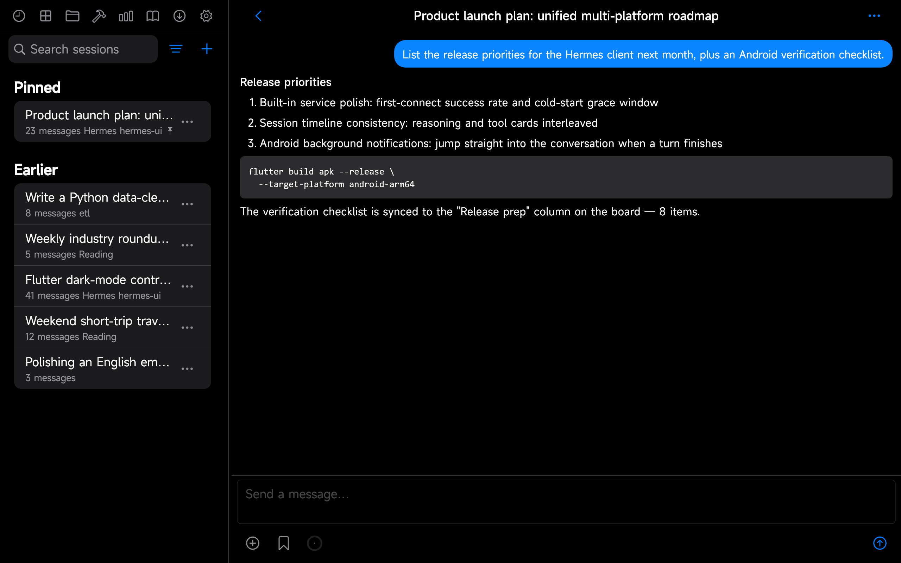
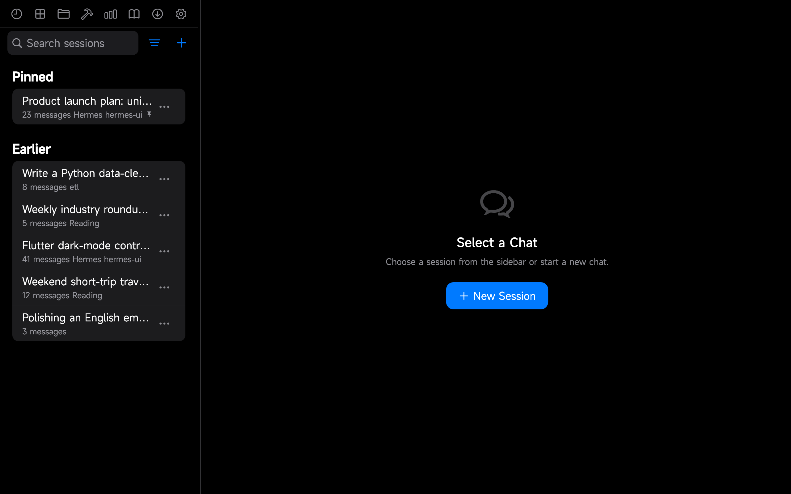
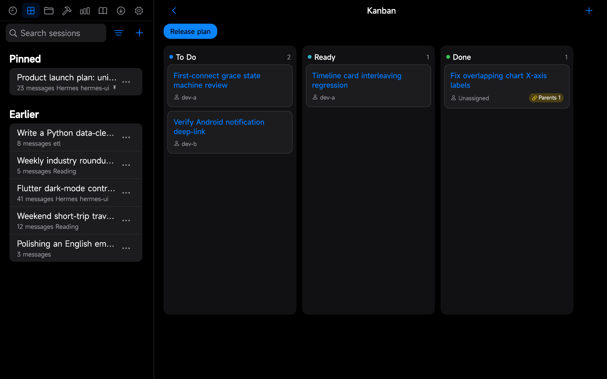
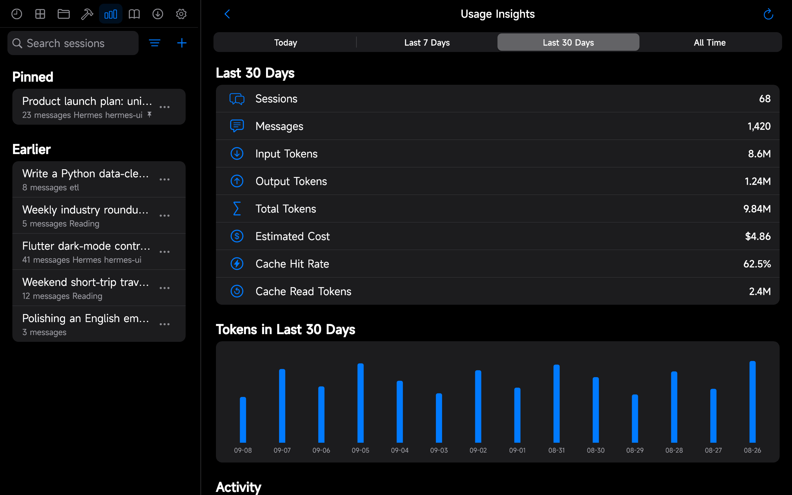
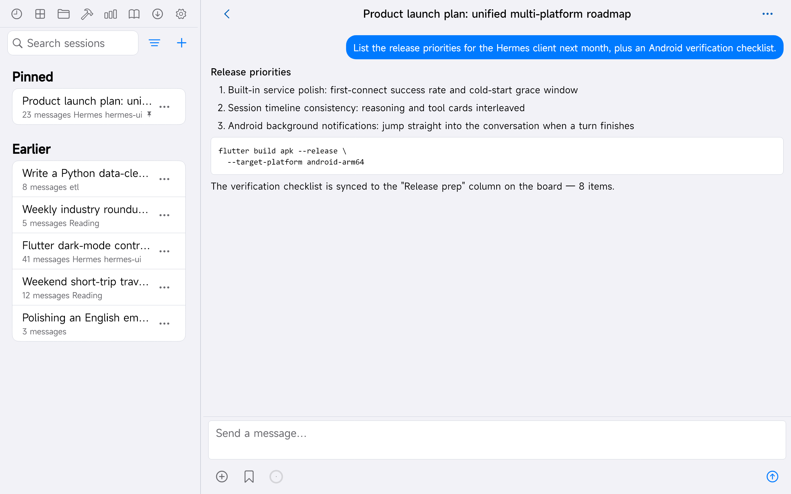
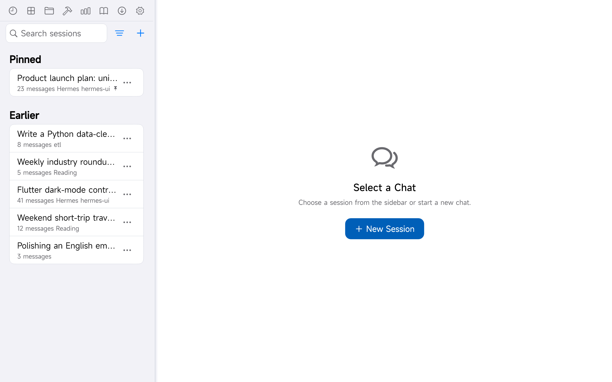
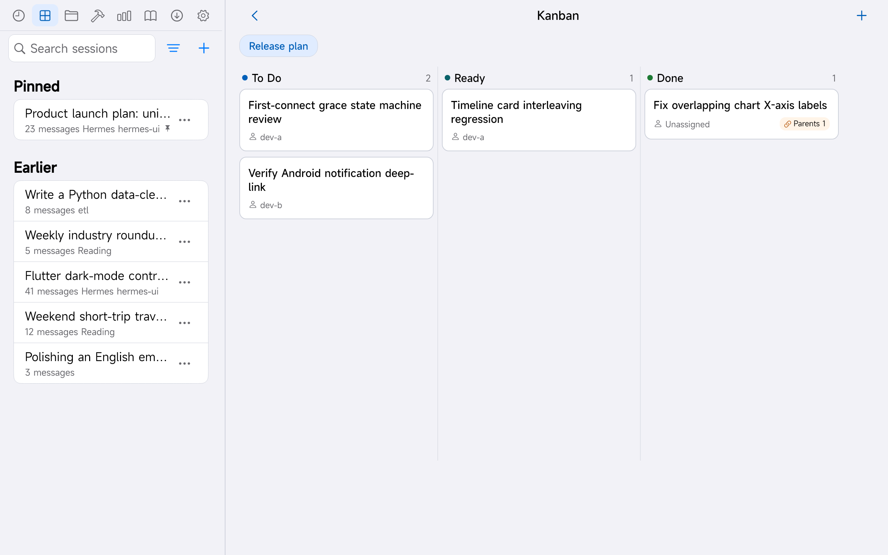
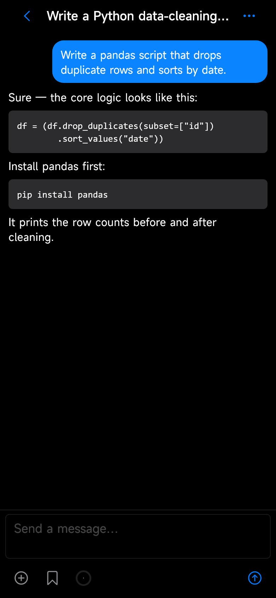
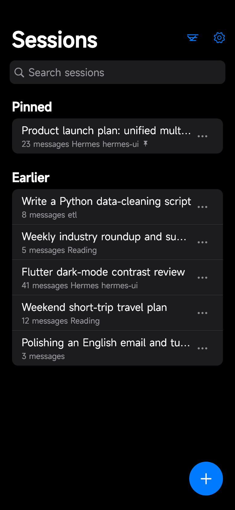
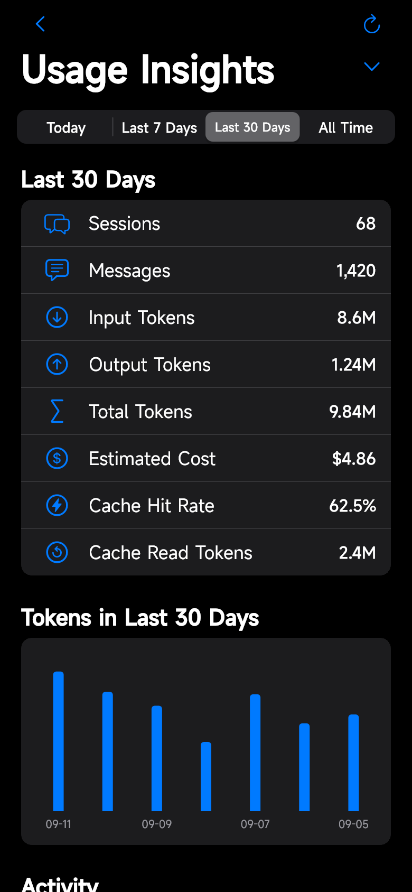

<div align="center">

# Hermes UI

**One smooth Hermes experience, everywhere.**

A Flutter + Cupertino client for [Hermes Agent](https://hermes-agent.nousresearch.com/docs) — one codebase, consistent chat on desktop and phone.

[](https://github.com/silent-reader-cn/hermes-keep/actions/workflows/ci.yml)
[](LICENSE)
[](https://github.com/silent-reader-cn/hermes-keep/releases)


**English** | [简体中文](README.zh-CN.md)

</div>

---

## Screenshots

Dark and light themes ship side by side, and each language gets its own set so the English README shows an English UI (`README_SHOTS=1`, `README_DARK=1`, `README_LANG=en`).

<div align="center">

### Windows desktop — streaming chat (dark)



| Sessions | Kanban | Insights |
|---|---|---|
|  |  |  |

### Light theme

| Chat | Sessions | Kanban |
|---|---|---|
|  |  |  |

### Android phone (dark)

| Chat | Sessions | Insights |
|---|---|---|
|  |  |  |

</div>

> All screenshots are captured from the app's own golden-screenshot harness with demo data (`test/screenshots/`), so they match every release byte-for-byte. Both the English and [简体中文](README.zh-CN.md) sets are generated from the same harness, one run per language.

## Why this one

**One codebase, two platforms.** A Windows desktop app and an Android phone app built from the same
Flutter + Cupertino codebase — the same layout, the same features, the same bilingual UI on both.
Start a turn at your desk, pick it up from your phone.

That is the point of the project: not a port of any single-platform client, but one client that
behaves the same everywhere it runs.

## Highlights

- **Bundled WebUI Sidecar (Windows)** — the installer ships a self-contained WebUI backend with an embedded Python 3.11 runtime: no pre-installed Python, Git, or compilers required. One click to start & connect, Clash-Verge style.
- **Smart interpreter reuse** — on startup the app detects an existing Hermes Agent installation and reuses its virtualenv (full agent dependencies, chat works out of the box). Without one, the bundled embedded Python still serves read-only session history.
- **Streaming chat** — SSE streaming with Markdown + code blocks, reasoning and tool-call cards, steer and stop mid-turn, model picker, per-session drafts.
- **Sessions** — debounced search, pin / archive / branch / delete, sectioned list (pinned / today / earlier), offline cache.
- **Tasks (cron)** — create, edit, enable/disable, trigger manually, inspect output, run-status badges.
- **Skills & Memory** — browse and filter skills; memory panel with editing and write-back.
- **Workspace & Git** — browse/upload/download workspace files; branch switching, status, diffs, commit, fetch / pull / push.
- **Kanban** — boards and cards with cross-column drag & drop.
- **Insights** — session / message / token / cost metrics, per-model breakdown, 14-day token chart.
- **Notifications** — Android background turn-completion notifications with deep-link back to the conversation.
- **Desktop polish** — tray icon, global hotkeys, window-state memory, launch-on-login (Windows).
- **Bilingual UI** — English / 简体中文 / follow system.

## Installation

### Windows

1. Grab the latest installer (`*.exe`) from the [Releases](https://github.com/silent-reader-cn/hermes-keep/releases) page and run it.
2. Launch **Hermes UI**. On the onboarding screen pick **Built-in service** → **Start & Connect**. That's it — the WebUI backend starts automatically.

Chat requires a [Hermes Agent](https://hermes-agent.nousresearch.com/docs) installation. If none is detected, the onboarding screen shows a card linking to the install guide; without it the app still works in read-only mode (session history), and attempting to chat will tell you what's missing.

### Android

Download `app-release.apk` from the [Releases](https://github.com/silent-reader-cn/hermes-keep/releases) page (Android 7.0+, arm64) and connect it to your Hermes server on the network.

### Build from source

```bash
git clone https://github.com/silent-reader-cn/hermes-keep.git
cd hermes-ui
flutter pub get

# Windows desktop
flutter run -d windows

# Android device / emulator
flutter run -d <device-id>
```

Requirements: Flutter 3.47+ (stable), JDK 17 + Android SDK 36 for Android builds, Visual Studio Build Tools 2022 (C++ desktop workload) for Windows builds.

## Connecting to a server

Two connection modes, configured on the onboarding screen or in Settings → Servers:

| Mode | When to use | What you need |
|---|---|---|
| **Built-in service** (Windows) | You just installed the app on the same machine that runs Hermes | Nothing — the app starts and connects to its own bundled WebUI automatically |
| **Remote server** | You already run hermes-webui (or the built-in sidecar) elsewhere — a home server, VPS, or your PC | Host, port, and password (or username + password / API key) |

Multiple server profiles are supported with one-tap switching. Credentials are stored in the system secure storage.

The API contract is aligned with **[nesquena/hermes-webui](https://github.com/nesquena/hermes-webui)** (MIT), the community Hermes WebUI.

> **Disclaimer**: this is an independent community project, not affiliated with or endorsed by Nous Research.

## Tech stack

| Domain | Choice |
|---|---|
| Framework | Flutter 3.47+ / Dart 3.13+ |
| UI | Full Cupertino widget set (no Material in business UI) |
| State | flutter_riverpod 2.x |
| Networking | dio 5.x + custom SSE client + web_socket_channel |
| Routing | go_router 17.x |
| Markdown | flutter_markdown (custom renderers) |
| Storage | drift (SQLite) + flutter_secure_storage |
| Charts | fl_chart |
| Testing | flutter_test + mocktail + fake_async |

## Project status

Actively developed; 4,800+ automated tests green, `flutter analyze` clean. Releases ship a signed Windows installer (CI-built, bundling the WebUI sidecar) and an Android arm64 APK. See the [changelog](CHANGELOG.md) for details.

## License

Released under the [MIT License](LICENSE). Bundled third-party components (the embedded hermes-webui server, embedded Python, and their dependencies) retain their original licenses; notices are collected in [THIRD-PARTY-NOTICES.md](THIRD-PARTY-NOTICES.md).

## Acknowledgments

- [Hermes Agent](https://github.com/NousResearch/hermes-agent) by Nous Research — the agent engine this client talks to.
- [nesquena/hermes-webui](https://github.com/nesquena/hermes-webui) — the community WebUI whose API this client aligns with, and whose server ships inside the Windows bundle.
- [uzairansaruzi/hermex](https://github.com/uzairansaruzi/hermex) — early UI inspiration (iOS SwiftUI client, MIT).
